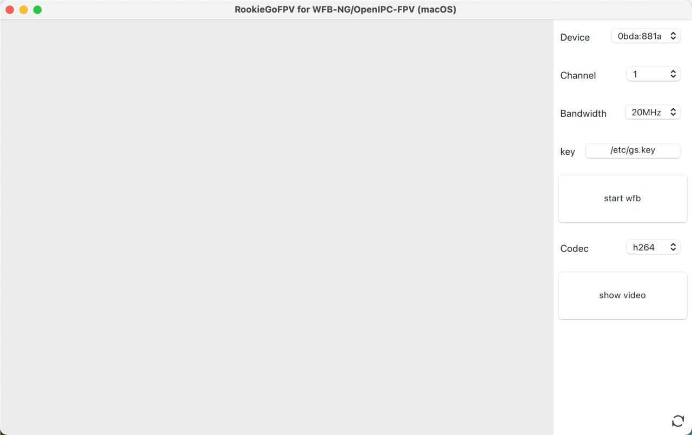

## This is a Video Receiver for MacOS version

The macOS application serves as a decoder for H.264 and H.265 video streams, seamlessly receiving and processing broadcasts transmitted by wfb-ng over-the-air.

- [fpv4win](https://github.com/OpenIPC/fpv4win.git): A Windows platform WiFi Broadcast FPV client.
- [devourer](https://github.com/openipc/devourer): A userspace rtl8812au driver initially created by [buldo](https://github.com/buldo) and converted to C by [josephnef](https://github.com/josephnef) .
- [wfb-ng](https://github.com/svpcom/wfb-ng): A library that allows broadcasting the video feed over the air.

Supported rtl8812au WiFi adapter only.

It is recommended to use with [OpenIPC](https://github.com/OpenIPC) FPV



### How to build
- macOS - arm64
```shell
git clone 
cd RookieGoFPV
git submodule update --init --recursive
mkdir build && cd build
# cmake .. -DCMAKE_PREFIX_PATH=/your/path/to/Qt/version/lib/cmake
# for example
cmake .. -DCMAKE_PREFIX_PATH=/Users/john/Qt/6.5.3/macos/lib/cmake
make -j$(nproc)
```

---
### How to run
1. install homebrew,this is a package manager for macOS  
visit [homebrew](https://brew.sh/) 
2. use brew to install libsodium, libpcap, libusb, gstreamer, gst-plugins-base, gst-plugins-good, gst-plugins-bad, gst-plugins-ugly
```shell
brew install libsodium libpcap libusb gstreamer gst-plugins-base gst-plugins-good gst-plugins-bad gst-plugins-ugly
````
3. install qt6
```shell
brew install qt
```
4. run